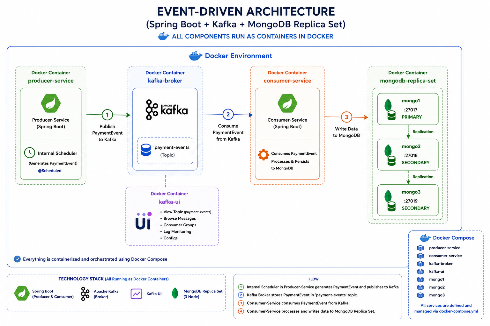

# About the project

This is a sample project that explain the usage of Kafka as a message broker.
It's a multimodule maven project with producer service and consumer service are designed as separate modules

# How to run the project

* Make sure you have docker engine (or Docker desktop) installed and running
* Run the mvn clean package command from the project root to build consumer-service and producer-service jar files. 
  *  **`mvn clean package`**
* Run the docker-compose.yml from the project root to create and start all docker containers (producer-service/consumer-service/kafka broker/kafka-ui/mongodb-replicaset)
  *  **`docker compose up --build -d`**
* * Log in to one of the mongo nodes(Ex: mongo1) and initialize the replica set with below command
  * `docker exec -it mongo1 mongosh`
  * `rs.initiate({_id: "rs0",
        members: [
        { _id: 0, host: "mongo1:27017" },
        { _id: 1, host: "mongo2:27017" },
        { _id: 2, host: "mongo3:27017" }
        ]
        })`
* Producer is sending a message in every 3 seconds to the kafka broker which supposed to be consumed by the consumer and persisted to the mongo db cluster
* Kafka ui is available in : http://localhost:8090/

Step 1: Enable Ingress in Minikube
* Run the below command to enable ingress in minikube
  * **`minikube addons enable ingress`**
* Check it:
  * **`kubectl get pods -n ingress-nginx`**

# Architecture

to get the kafka.ui service IP : (without using ingress option)
minikube service kafka-ui --url

Build docker image from docker file:
docker build -t arunasilva/consumer-service:1.0 .

Upload image from local docker to minikube docker registry:
minikube image load arunasilva/consumer-service:1.0

Step 4: Point kafka-ui.local to Minikube IP (IMPORTANT)

Run:

minikube ip

Example output:

192.168.49.2

Now edit your hosts file:

File location (Windows):
C:\Windows\System32\drivers\etc\hosts

Add:

192.168.49.2 kafka-ui.local
